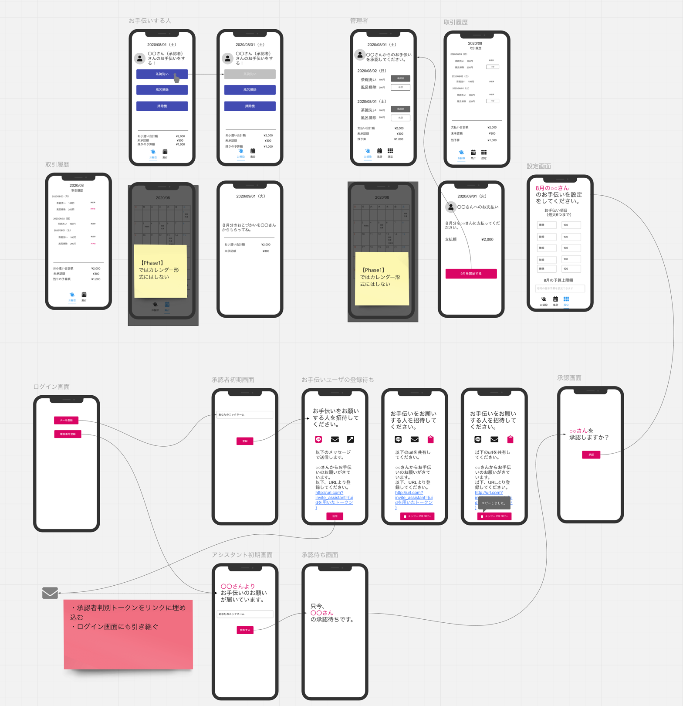

# 家事お手伝いプロトタイプなアプリ

## コンセプト
- 家族内のお手伝いを加速させる。
- `TeamSpirit`や`IEYASU`みたいな勤務管理ツールのように、ワンクリックで作業申請・認証するよう設計。
- お手伝い状況の可視化。

## 説明
- 我が家の家事を加速させるためのプロトタイプのアプリです。
- プライベートで運用しながら、ブラッシュアップするかもしれません。
- 気分次第でFirestoreを全削除したりしますのでご了承ください。
- とりあえず、プロトタイプということで。
- [TODO](##TODO)があります。

## ワイヤーフレーム

## システム構成図
- 多分書きます。

## 利用技術やライブラリなど

### 言語
- TypeScript

### ライブラリ
- React
- React hooks
- React context
- react-hook-form / yup
- react-firebase-hooks
- Material-UI
- などなど。

### サーバレス
- Firebase Authentication
- Cloud Firestore
- Firebase Hosting
- Cloud Functions for Firebase

### その他
- Github actions
- Docker
- Firebase Local Emulator Suite

## TODO
- 第2フェーズとしてこっそりとプライベートレポジトリで、`Next.js`で書き換える。
- domain以下がひどいのでリファクタする。（第2フェーズリポジトリ）
- functionsもリファクタ検討する。（第2フェーズリポジトリ）
- 細かい追加機能。（第2フェーズリポジトリ）
- 第3フェーズで、ガワネイティブしてプッシュ通知受け取るかは全く未定です。（おそらくやりません）

## 作成してみて感じたこと
- `Redux` 必要なかった。
  - 個人的には`Context + useStateやuseReducer`で問題ない気がしてきました。
  - `react-firebase-hooks` 使ったら尚更いらならないと感じました...
- なぜか、SendGridからアカウント停止された...（サポートにも連絡したのに） が別手法のほうがユーザ体験良かったので、必要なくなった。
- SendGridやAWS SES使うにしても`バウンス対策`って結構面倒だということがわかった。
- 検証のため`Create React App` で頑張ったけど、素直に`webpack.config`で再構築しようかなぁと思ったこと多数。
  - `react-app-rewired` に手を出しそうだったけどなんとか踏みとどまりました。
- ~~`Formik（ver1）`には苦い思い出があるので~~ `react-hook-form` 使いました。最高でした。
- 上記はゲキ弱エンジニアのひとりごとです。